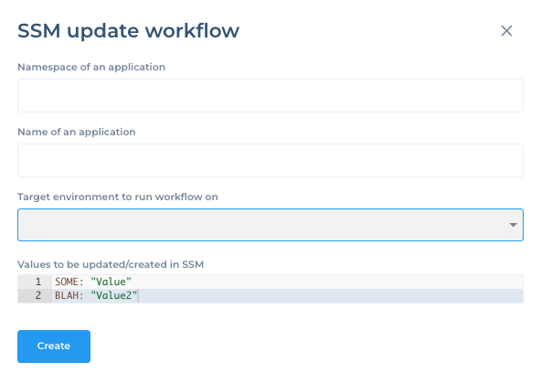

# Job Structure

```mermaid
flowchart TD
    subgraph Workflow_Controller
        WF[Workflow]
        JobDef[Job (Definition)]
        WF --> JobDef
        note1[/"Job is defined as JSON (inputs/outputs)"/]
        JobDef --> note1
    end

    subgraph MagicFlow_Worker
        JobCode[Job (Implementation)]
        note2[/"Job implemented as Python code in `/jobs/lib`"/]
        JobCode --> note2
    end

    JobDef -- executed by --> JobCode
```

## workflow-controller API 

Define wokflow that will be imported in to workflow-controller API by POST request.  `category` and `type` not play any critical role in execution or provisioning . 

`parameters` are fields you expect some value to add 




```
# Post workflow templates
for i in $DIRECTORY/workflow-*.json; do
    # Process $i
    curl -XPUT $API_URL/workflow-templates --header "Content-Type: application/json" --header "Authorization: Bearer $API_TOKEN" -d @$i
done
```

example workflow JSON 

```json
{
    "name": "SSM update workflow",
    "template": "true",
    "description": "To update/create secrets for an application",
    "category": "Provisioning",
    "type": "Secrets",

    "parameters": [
        {
            "name": "namespace",
            "value": "",
            "description": "Namespace of an application"
        },
        {
            "name": "name",
            "value": "",
            "description": "Name of an application"
        },
        {
          "name": "Environment",
          "type": "target-environment",
          "value": "",
          "description": "Target environment to run workflow on"
      },        
        {
            "name": "values",
            "type": "yaml",
            "value": "SOME: \"Value\"\r\nBLAH: \"Value2\"",
            "description": "Values to be updated/created in SSM"
        },
        {
            "name": "target-environment",
            "value": "",
            "type": "target-environment",
            "description": "Name of the environment"
        }
    ],
    "jobs": [
        {
            "name": "ssm_update",
            "description": "Update/create SSM secrets for an application",
            "order": 0,
            "controller": "",
            "input": {
                "values": "",
                "name": "",
                "namespace": ""
            },
            "output": {
                "error": {}
            },
            "status": "New"
        }
    ]
}
```

job `name` shoudl be = function name in magicflow-worker `jobs/lib` . `@j.register("ssm_update")`

```
magicflow/
└── jobs/
    └── lib/
        ├── dummy.py
        └── ssm.py

```

## magicflow-worker 

Service where your actual python code jobs are deployed in `jobs/lib` path as per above . 
if we have multiple jobs in workflow, controller will convert etch job in to kafka message adding attributes with workflow_id 

```
    "jobs": [{
            "name": "dummy_job",
            "description": "Dummy job. Does nothing.",
            "order": 0,
            "controller": "",
            "input": {
                "mr_id": "",
                "start_date": "",
                "features": "",
                "incident_description": ""
            },
            "output": {
                "error": {}
            },
            "status": "New"
        },
        {
            "name": "dummy_job",
            "description": "Dummy job. Does nothing.",
            "order": 0,
            "controller": "",
            "input": {
                "mr_id": ""
            },
            "output": {
                "error": {}
            },
            "status": "New"
        }
    ]
```