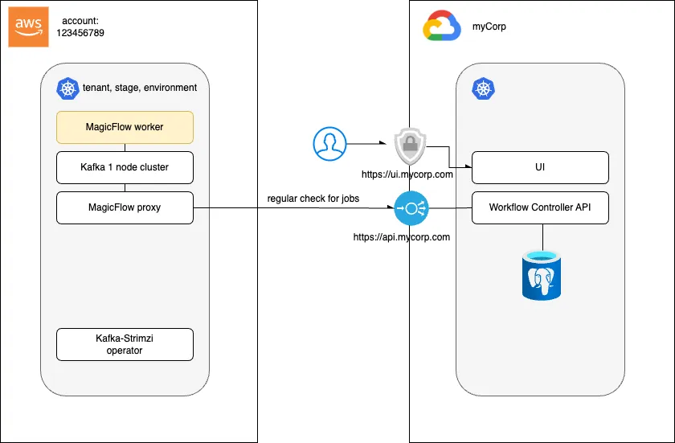

# Architecture

## Glossary

| **Term**             | **Definition** |
|----------------------|----------------|
| **Workflow**         | An end-to-end (E2E) process that executes a defined sequence of operations, conceptually similar to a GitLab pipeline.   Key characteristics: • Unidirectional execution flow • Each step (a job or group of jobs) is triggered only after the previous step completes successfully • Rollback is not currently supported • Steps are idempotent—restarting a step produces the same result |
| **Workflow Step**    | A discrete unit of work such as "create merge request", or a logical grouping of independent jobs. |
| **Workflow Job**     | A function that performs a specific operation. Jobs accept input parameters and return output results. |
| **Command**          | A JSON-based message representing an instruction to execute a specific job with specific parameters.   _Note: The presence of a command does not guarantee that the job has been executed._ |
| **Event**            | A JSON-based message containing the result of a job execution.   _Note: The presence of an event confirms that the job has successfully completed._ |
| **Workflow Controller** | A SAGA-like service that implements the business logic of the workflow. It manages the state and orchestrates the flow by translating events into commands. |

---

## Integration Architecture Example

The diagram above illustrates a remote job execution architecture.

Within Google Cloud, microservices are deployed alongside a **Workflow Controller**—an API with state management capabilities. This controller is responsible for:

- Managing and storing active workflow instances
- Receiving job status updates
- Orchestrating the sequence of job executions

This enables asynchronous, event-driven execution of workflows across distributed services.
